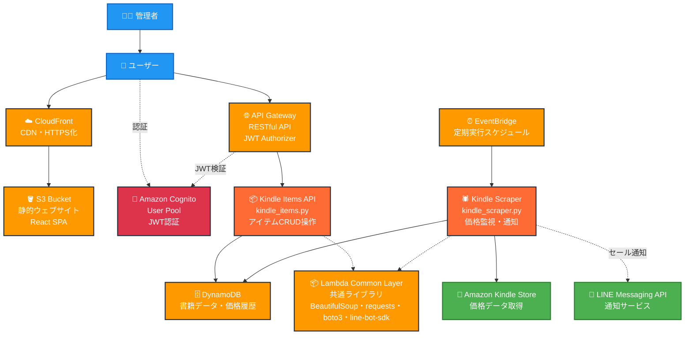

# はじめに
これらのソースはほぼ全てAIに作ってもらいました  
主に使ったのはこれらです
- Claude Sonnet 3.7
  - 前半はこれがメイン
- Claude Sonnet 4
  - 途中でこれがリリースされたので後半はこれがメイン
- Gemini 2.5 Flash
  - Claudeで埒が明かない時に助けてもらった

これより下はすべてAIが考えてくれました  
ではどうぞ

# Kindle Sale Checker

AWS (CloudFront, S3, Lambda, DynamoDB, Cognito)を使用したKindleの本のセール情報チェックシステムです。

## 概要

このプロジェクトは、AWSのサーバーレスアーキテクチャを活用した、Kindleの本のセール情報をトラッキングするWebアプリケーションです。ユーザーはAmazonの本のURLを入力して登録でき、システムが自動的にセール情報をスクレイピングして価格変動を監視します。セール条件に合致した際にはLINE通知で知らせる機能を備えています。

**🔐 認証機能**: AWS Cognitoを使用した完全なユーザー認証システムにより、管理者が作成したユーザーのみがアクセス可能です。

## AWS構成図



## アーキテクチャ

- **フロントエンド**: React (CloudFront + S3でホスティング)
- **認証**: AWS Cognito (JWT認証・長期セッション)
- **バックエンド**: AWS Lambda (Python 3.13)
  - **Kindle Items API**: アイテムのCRUD操作
  - **Kindle Scraper**: 価格監視・スクレイピング・通知
- **データベース**: DynamoDB
- **インフラ**: Terraform（モジュール化）
- **スクレイパー**: 自己スケジューリング型Lambdaによるスクレイピング
- **通知**: LINE Messaging API
- **CDN**: CloudFront (HTTPS・高速配信)

## 主な機能

### 🔐 **認証・セキュリティ**
- **完全認証保護**: 未認証ユーザーはアクセス不可（404レスポンス）
- **管理者制御**: 管理者のみが新規ユーザーを作成可能
- **長期セッション**: 3650日有効なリフレッシュトークン
- **初回パスワード設定**: 管理者作成後の初回ログイン時にパスワード設定

### 📚 **書籍管理（Kindle Items API）**
- **Kindleの本の登録/削除**: AmazonのURLを登録するだけで簡単に監視可能
- **アイテム一覧表示**: 登録済みの本の価格・セール状況を表示
- **CRUD操作**: 認証されたユーザーのみが操作可能

### 🕷️ **価格監視（Kindle Scraper）**
- **自動価格監視**: 定期的な価格チェックによりセール情報を自動検出
- **重複通知防止**: 同じ本は1週間以内に再通知されないよう制御
- **例外的な価格変動検知**: 大幅な値下げが発生した場合は再通知
- **自己スケジューリング**: スクレイパーが自らの次回実行タイミングを設定

### ⚙️ **システム機能**
- **セール条件設定**: 設定可能な割引率や価格閾値でセール判定をカスタマイズ可能
- **LINE通知**: セール発生時にはリッチメッセージでお知らせ
- **高速配信**: CloudFrontによる世界規模のCDN配信
- **共通レイヤー**: Lambda関数間での依存関係共有

## 技術スタック

- **フロントエンド**:
  - React 18.3.1
  - amazon-cognito-identity-js (認証)
  - axios (HTTP通信)
  - CloudFront + S3ウェブサイトホスティング

- **バックエンド**:
  - Python 3.13
  - AWS Lambda
    - **kindle_items.py**: Kindle Items API (アイテム管理)
    - **kindle_scraper.py**: Kindle Scraper (価格監視・通知)
  - AWS API Gateway (JWT Authorizer)
  - AWS EventBridge (CloudWatch Events)

- **認証**:
  - Amazon Cognito User Pool
  - JWT (JSON Web Token)
  - 長期リフレッシュトークン

- **データストレージ**:
  - Amazon DynamoDB

- **スクレイピング**:
  - Beautiful Soup 4
  - Requests
  - User-Agent Rotation

- **通知**:
  - LINE Messaging API
  - Flex Message

- **インフラ管理**:
  - Terraform（モジュール化）
  - AWS CLI

## 前提条件

- AWS CLI (設定済み)
- Terraform (v1.0以上)
- Python 3.9以上
- Node.js 14以上
- npm または yarn
- LINE Messaging API（通知機能用）

## セットアップ方法

### 1. リポジトリのクローン

```bash
git clone https://github.com/yourusername/kindle_sale_checker.git
cd kindle_sale_checker
```

### 2. コンポーネント名の更新（必要に応じて）

```bash
# 既存プロジェクトの場合、役割を明確化するための名前変更
chmod +x rename_all_components.sh
./rename_all_components.sh
```

### 3. 環境変数の設定

機密情報は`terraform.tfvars`ファイルに保存します。テンプレートから作成してください：

```bash
cp terraform/terraform.tfvars.template terraform/terraform.tfvars
```

`terraform.tfvars`を編集し、必要な環境変数を設定してください：

```hcl
# LINE APIの設定（機密情報）
line_channel_access_token = "YOUR_LINE_CHANNEL_ACCESS_TOKEN"
line_user_id              = "YOUR_LINE_USER_ID"

# セール条件の設定
sale_percentage = 20  # 20%以上の割引があれば通知
sale_price      = 500 # 500円以下の場合に通知
```

### 4. フロントエンド依存関係のインストール

```bash
cd frontend
npm install amazon-cognito-identity-js
cd ..
```

### 5. 全体デプロイ

一括デプロイスクリプトを使用してすべてのコンポーネントをデプロイします：

```bash
chmod +x deploy_all.sh
./deploy_all.sh production --auto-yes
```

### 6. 管理者ユーザーの作成

**🚨 重要**: このシステムは認証が必須です。デプロイ後、必ず管理者ユーザーを作成してください。

```bash
# 管理者ユーザーを作成
chmod +x create_admin_user.sh
./create_admin_user.sh admin@example.com

# 出力例:
# 生成されたユーザー名: admin_at_example_com
# メールアドレス: admin@example.com
# 一時パスワード: [自動生成されたパスワード]
```

### 7. 初回ログイン

1. **ブラウザでアクセス**: CloudFrontのURLにアクセス
2. **ログイン**: メールアドレスと一時パスワードでログイン
3. **新パスワード設定**: 初回ログイン時に新しいパスワードを設定
4. **完了**: メインアプリケーションにアクセス可能

## ユーザー管理

### 新規ユーザーの作成

管理者のみが新規ユーザーを作成できます：

```bash
# 基本的な作成方法
./create_admin_user.sh user@example.com

# カスタムパスワードを指定
./create_admin_user.sh user@example.com MyTempPassword123!
```

## 個別デプロイ

各コンポーネントを個別にデプロイすることもできます：

```bash
# Kindle Items API + Scraper Lambda関数のみデプロイ
./deploy_kindle_functions.sh

# Lambda Layerのみデプロイ
./deploy_lambda_layer.sh

# フロントエンドのみデプロイ
./deploy_frontend.sh

# Cognito設定の更新
./update_cognito_config.sh
```

## ビルドスクリプト

個別コンポーネントのビルドも可能です：

```bash
# Kindle Items API Lambda関数のビルド
./build_kindle_items.sh

# Kindle Scraper Lambda関数のビルド
./build_kindle_scraper.sh

# 共通Lambda Layerのビルド
./build_lambda_layer.sh
```

## プロジェクト構造

```
kindle_sale_checker/
├── terraform/                    # Terraformファイル
│   ├── main.tf                   # メインのTerraformファイル
│   ├── variables.tf              # 変数定義
│   ├── outputs.tf                # 出力定義
│   ├── terraform.tfvars          # 機密変数（Gitにコミットしない）
│   ├── terraform.tfvars.template # 機密変数のテンプレート
│   ├── environments/             # 環境別変数ファイル
│   └── modules/                  # Terraformモジュール（役割別）
│       ├── s3/                   # S3 + CloudFrontモジュール
│       ├── cognito/              # Cognito認証モジュール
│       ├── dynamodb/             # DynamoDBモジュール
│       ├── iam/                  # IAMモジュール
│       ├── kindle_items/         # Kindle Items APIモジュール
│       ├── kindle_scraper/       # Kindle Scraperモジュール
│       ├── lambda_common_layer/  # 共通Lambdaレイヤーモジュール
│       ├── api_gateway/          # API Gateway + JWT認証モジュール
│       └── cloudfront/           # CloudFrontモジュール
├── lambda/                       # Lambda関数のソースコード
│   ├── kindle_items.py           # Kindle Items API（アイテム管理）
│   ├── kindle_scraper.py         # Kindle Scraper（価格監視・通知）
│   ├── common_requirements.txt   # 共通の依存関係
│   └── requirements.txt          # 個別の依存関係
├── frontend/                     # Reactフロントエンド
│   ├── public/                   # 静的ファイル
│   ├── src/                      # ソースコード
│   │   ├── App.js                # メインコンポーネント（認証対応）
│   │   ├── AuthComponent.js      # 認証コンポーネント
│   │   ├── authService.js        # Cognito認証サービス
│   │   ├── Auth.css              # 認証画面スタイル
│   │   └── App.css               # アプリスタイル
│   └── package.json              # npm設定（Cognito依存関係含む）
├── build_kindle_items.sh         # Kindle Items APIビルドスクリプト
├── build_kindle_scraper.sh       # Kindle Scraperビルドスクリプト
├── build_lambda_layer.sh         # 共通レイヤービルドスクリプト
├── deploy_kindle_functions.sh    # Kindle Lambda関数デプロイスクリプト
├── deploy_lambda_layer.sh        # Lambda Layerデプロイスクリプト
├── deploy_frontend.sh            # フロントエンドデプロイスクリプト
├── deploy_all.sh                 # 一括デプロイスクリプト
├── create_admin_user.sh          # 管理者ユーザー作成スクリプト
├── update_cognito_config.sh      # Cognito設定更新スクリプト
├── rename_all_components.sh      # コンポーネント名変更スクリプト
└── .gitignore                    # Gitの除外ファイル設定
```

## システムの特徴

### 🔒 **セキュリティ**

- **JWT認証**: すべてのAPIエンドポイントで認証必須
- **長期セッション**: 3650日有効なリフレッシュトークン（実質無期限）
- **自動トークンリフレッシュ**: 期限切れ前に自動更新
- **HTTPS強制**: CloudFrontによる全通信のHTTPS化
- **404レスポンス**: 未認証時は404を返し、情報漏洩を防止

### 🎯 **インテリジェントな通知制御**

- **重複通知防止**: 同じ本は1週間（7日間）は再通知されません
- **例外的な再通知**: 実質価格が前回より10%以上安くなった場合は再通知
- **ログ詳細化**: 通知判断の理由がログから追跡可能

### 🕷️ **スクレイピング強化**

- **User-Agent ローテーション**: 複数の最新ブラウザのUser-Agentをランダムに使用
- **待機時間のランダム化**: 検出回避のためのランダムな待機時間設定
- **自動リトライ**: エラーに強い例外処理とリトライ機能

### ⚡ **パフォーマンス**

- **CloudFront CDN**: 世界規模の高速コンテンツ配信
- **Lambda Layer**: 共通ライブラリの効率的な管理
- **DynamoDB**: 高速でスケーラブルなNoSQLデータベース

### 🧩 **モジュール化**

- **役割明確化**: 各コンポーネントの責任が明確に分離
- **独立デプロイ**: 各Lambda関数を個別にデプロイ可能
- **共通レイヤー**: 依存関係の一元管理

## カスタマイズ方法

### セール条件の変更

`terraform.tfvars`ファイルでセール条件を変更できます：

```hcl
# セール条件の設定
sale_percentage = 30  # 30%以上の割引があれば通知
sale_price      = 300 # 300円以下の場合に通知
```

### 通知間隔の変更

`kindle_scraper.py`内の`NOTIFICATION_INTERVAL_DAYS`変数を変更して、通知間隔を調整できます：

```python
# 通知間隔設定（例：3日に変更）
NOTIFICATION_INTERVAL_DAYS = 3
```

### スクレイピング頻度の変更

スクレイピングの実行頻度を変更するには、`next_schedule`関数の`minutes_delay`変数を調整します：

```python
# より頻繁にチェック（例：3-6時間ごと）
minutes_delay = random.randint(180, 360)
```

## トラブルシューティング

### 認証関連

**問題**: "User pool client does not exist" エラー
```bash
# 解決方法: Cognito設定を更新
./update_cognito_config.sh
./deploy_frontend.sh production --auto-yes
```

**問題**: 新パスワード設定ができない
- 初回ログイン時は自動で新パスワード設定画面に移行します
- パスワード要件: 8文字以上、英数字を含む

### デプロイ関連

**問題**: ACL権限エラー
```bash
# 解決方法: S3バケットポリシーを再適用
cd terraform
terraform apply
```

**問題**: CloudFrontアクセスエラー
```bash
# 解決方法: キャッシュクリア
cd terraform
DISTRIBUTION_ID=$(terraform output -raw cloudfront_distribution_id)
aws cloudfront create-invalidation --distribution-id $DISTRIBUTION_ID --paths "/*"
```

**問題**: Lambda関数のデプロイ失敗
```bash
# 解決方法: 個別にビルド・デプロイ
./build_kindle_items.sh
./build_kindle_scraper.sh
./deploy_kindle_functions.sh production --auto-yes
```

**問題**: Lambda Layer関連エラー
```bash
# 解決方法: レイヤーを再作成・デプロイ
./build_lambda_layer.sh
./deploy_lambda_layer.sh production --auto-yes
```

### スクレイピング関連

**問題**: Amazonのサイト構造が変更された場合
`get_kindle_info`関数のセレクタを更新する必要があります：

```python
# 現在の価格を取得するセレクタを更新する例
current_price_elem = soup.select_one(".newPriceSelector .a-color-price")
```

### ログの確認

CloudWatch Logsでログを確認し、詳細なエラー情報や処理状況を確認できます：

```bash
# Kindle Items APIのログ
aws logs get-log-events \
  --log-group-name /aws/lambda/kindle_items_api \
  --log-stream-name <最新のログストリーム>

# Kindle Scraperのログ
aws logs get-log-events \
  --log-group-name /aws/lambda/kindle_scraper \
  --log-stream-name <最新のログストリーム>
```

## セキュリティについて

**⚠️ 機密情報管理の重要性**

このプロジェクトでは機密情報が含まれています。詳細なセキュリティガイドラインについては、[SECURITY.md](SECURITY.md)を必ずお読みください。

### **主要なセキュリティポイント**
- `terraform.tfvars` は絶対にGitにコミットしない
- AWSアカウントIDやIAMユーザー名をコードに含めない
- LINE APIトークンなどの機密情報は環境変数で管理
- 定期的なアクセスログの監視を実施

## 料金について

このレベルの使用量（1日10回アクセス、3回リロード程度）での月額料金：

- **1年目**: 完全無料（AWS無料枠）
- **2年目以降**: 月額2〜3円程度

詳細：
- CloudFront: 12ヶ月無料枠（50GB、200万リクエスト/月）
- Lambda: 100万リクエスト/月まで無料
- DynamoDB: 25GB、2.5億リクエスト/月まで無料
- Cognito: 50,000人/月まで無料

## コンポーネント役割説明

### 📦 Kindle Items API (`kindle_items.py`)
- **責任**: Kindleアイテムの管理
- **機能**: 
  - アイテムの登録・取得・削除（CRUD操作）
  - DynamoDBとの連携
  - 認証済みAPIエンドポイントの提供
- **アクセス**: API Gateway経由、Cognito JWT認証必須

### 🕷️ Kindle Scraper (`kindle_scraper.py`)
- **責任**: 価格監視と通知
- **機能**:
  - Amazonからの価格スクレイピング
  - セール情報の検出
  - LINE通知の送信
  - 自動スケジューリング
- **実行**: EventBridge経由の定期実行

### 📦 Lambda Common Layer
- **責任**: 共通依存関係の管理
- **含まれるパッケージ**:
  - `boto3`: AWS SDK
  - `beautifulsoup4`: HTMLパーサー
  - `requests`: HTTP通信
  - `line-bot-sdk`: LINE通知
- **用途**: 両Lambda関数で共有、デプロイサイズの削減

## 今後の拡張予定

- **複数通知先対応**: 複数のLINEユーザーへの通知
- **価格履歴記録**: 過去の価格変動の記録と分析
- **ジャンル別管理**: 本のジャンル別の分類と管理
- **カスタム通知条件**: ユーザーごとの通知条件設定
- **ダッシュボード機能**: 価格推移グラフや統計情報の表示
- **Slack連携**: LINE以外の通知チャンネル追加
- **書籍メタデータ拡張**: 著者情報、出版日等の追加情報管理

## ライセンス

[MIT](LICENSE)

## 貢献方法

1. このリポジトリをフォーク
2. 新しいブランチを作成 (`git checkout -b feature/amazing-feature`)
3. 変更をコミット (`git commit -m 'Add amazing feature'`)
4. ブランチにプッシュ (`git push origin feature/amazing-feature`)
5. プルリクエストを作成

## 開発ガイドライン

### コーディング規約
- **Python**: PEP 8準拠
- **JavaScript/React**: ESLint標準設定
- **Terraform**: HashiCorp推奨スタイル
- **インデント**: 空白2文字（設定済み）

### テスト
```bash
# Lambda関数のローカルテスト
python -m pytest lambda/tests/

# フロントエンドのテスト
cd frontend && npm test
```

### デバッグ
```bash
# ローカル環境でのLambda関数実行
python lambda/kindle_items.py
python lambda/kindle_scraper.py

# フロントエンドの開発サーバー
cd frontend && npm start
```

---

ご質問やフィードバックがありましたら、issueを作成してください。